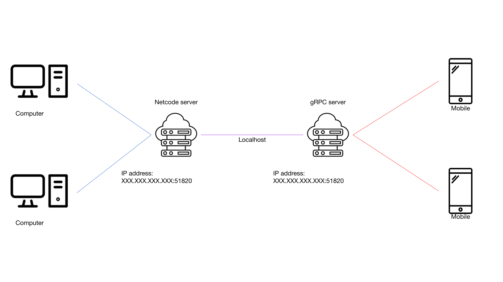

A game made for the second year of Cnam-Enjmin bachelor degree in video games.

# DESCRIPTION
Convergence is multiplayer online battle arena (MOBA) played from 2 to 8.  
It's cross-engine (Unreal Engine / Unity) and cross-platform (PC / Mobile). It's using Netcode For GameObjects for the networking between Unity clients and gRPC as a relay between Unity and Unreal Engine clients
For the networking, we used Netcode For GameObject for the Unity Clients and used gRPC for the bridge between Unity and Unreal Engine clients.

# ARCHITECTURE

# SOFTWARES
PC: [Unity](https://unity.com/fr)  
Mobile: [Unreal Engine](https://www.unrealengine.com/fr)  
Networking :  
- [Netcode For GameObjects (Unity <=> Unity)](https://docs-multiplayer.unity3d.com/netcode/current/about/index.html)
- [gRPC (Unity <=> Unreal Engine)](https://grpc.io/)

# DEVELOPPERS
- [Quoc-Bao NGUYEN](https://github.com/Baokebab)
- [Nathan GIROD](https://github.com/Blowerlop)
- [Guillaume WIART](https://github.com/Drainor-GameDev)
- [Helias GAMONET](https://github.com/LeBliblib)
- [Elessar THOMANN](https://github.com/Esp4donbreton)

# FOOTAGES

## GAMEPLAY

## STORY

## SCREENSHOTS

